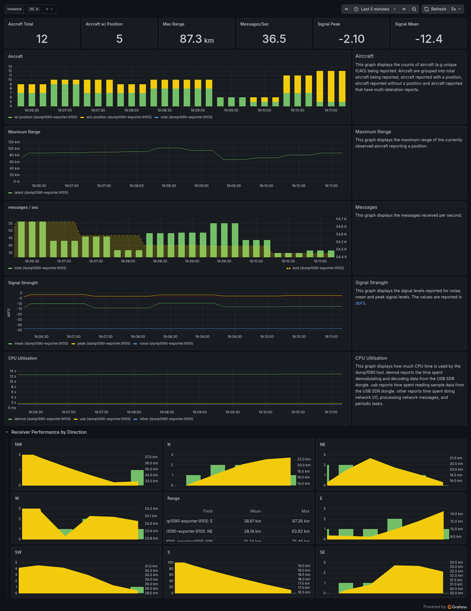

# dump1090-exporter

[](https://github.com/schubydoo/dump1090-exporter/actions/workflows/ci.yml)
[](https://github.com/schubydoo/dump1090-exporter/actions/workflows/lint.yml)
[](https://github.com/schubydoo/dump1090-exporter/actions/workflows/security.yml)
[](https://github.com/schubydoo/dump1090-exporter/actions/workflows/scorecard.yml)

[`dump1090`](https://github.com/flightaware/dump1090) is a Mode S decoder for
RTL-SDR devices commonly used for tracking aircraft. It exposes a handful of
operational stats as JSON files / HTTP endpoints.

`dump1090-exporter` scrapes those files and re-exposes them as
[Prometheus](https://prometheus.io/) metrics, ready for collection and
visualisation (e.g. with [Grafana](https://grafana.com/)).

This exporter has been used with:

- the `dump1090` mutability fork
- the `dump1090-fa` (FlightAware) fork
- [`readsb`](https://github.com/wiedehopf/readsb)

> **About this fork** — this is a maintained, up-to-date fork of
> [`claws/dump1090-exporter`](https://github.com/claws/dump1090-exporter)
> originally by Chris Laws. The upstream project is no longer maintained and
> doesn't work cleanly on current Python releases; this fork modernizes the
> tooling, security baseline, and release pipeline without changing the
> exporter's behaviour. All credit for the original design belongs to the
> upstream author.

## Quick start (Docker, recommended)

A multi-arch container image (`linux/amd64`, `linux/arm64`, `linux/arm/v7`)
is published to GitHub Container Registry on every release:

```shell
docker run --rm -p 9105:9105 \
  ghcr.io/schubydoo/dump1090-exporter:latest \
  --resource-path=http://192.168.1.201:8080/data \
  --latitude=-34.9285 \
  --longitude=138.6007
```

Then point Prometheus at `http://<host>:9105/metrics`.

The image runs as a non-root user (UID 1000) and includes a `HEALTHCHECK`
against the `/metrics` endpoint. Tagged releases are signed with `cosign`
keyless OIDC — see [SECURITY.md](SECURITY.md) for verification details.

## Install from source

Requires Python 3.11+ and [`uv`](https://docs.astral.sh/uv/).

```shell
git clone https://github.com/schubydoo/dump1090-exporter
cd dump1090-exporter
uv sync --extra dev
uv run dump1090exporter --help
```

`uvloop` is an optional dependency providing a faster asyncio event loop:

```shell
uv sync --extra uvloop --extra dev
```

## Usage

```shell
dump1090exporter \
  --resource-path=http://192.168.1.201:8080/data \
  --port=9105 \
  --latitude=-34.9285 \
  --longitude=138.6007 \
  --log-level info
```

`--resource-path` is the common base path to dump1090's JSON resources. It
can be an HTTP URL or a filesystem path. The exporter constructs:

- `{resource-path}/receiver.json`
- `{resource-path}/aircraft.json`
- `{resource-path}/stats.json`

When running co-located with dump1090, prefer the filesystem path:

```shell
dump1090exporter --resource-path=/run/dump1090-fa/ ...
```

### Refresh intervals

| Resource | Default interval | Override |
|---|---|---|
| `receiver.json` (before origin is known) | 10s | `--receiver-interval` |
| `receiver.json` (after origin is known) | 300s | (constant) |
| `aircraft.json` | 10s | `--aircraft-interval` |
| `stats.json` | 60s | `--stats-interval` |

### Origin / range calculation

`--latitude` and `--longitude` provide the receiver origin for range
calculations. If dump1090 itself is configured with a receiver position (and
serves it via `receiver.json`), the exporter picks that up automatically.

### Checking the metrics

```shell
$ curl -s http://127.0.0.1:9105/metrics | grep -v '^#'
dump1090_recent_aircraft_max_range{time_period="latest"} 1959.03
dump1090_messages_total{time_period="latest"} 90741
dump1090_recent_aircraft_observed{time_period="latest"} 4
dump1090_recent_aircraft_with_multilateration{time_period="latest"} 0
dump1090_recent_aircraft_with_position{time_period="latest"} 1
dump1090_stats_cpr_airborne{time_period="last1min"} 176
...
```

Every metric is prefixed with `dump1090_`. Stats are exposed with a
`time_period` label, defaulting to the `last1min` bucket (Prometheus is
better at retaining historical data than the exporter is).

The `stats.json` source provides 5 top-level buckets — `latest`, `last1min`,
`last5min`, `last15min`, `total`. Only `last1min` is exported by default.

## Prometheus configuration

```yaml
scrape_configs:
  - job_name: 'dump1090'
    scrape_interval: 10s
    scrape_timeout: 5s
    static_configs:
      - targets: ['192.168.1.201:9105']
```

## Visualisation

A ready-to-import Grafana dashboard ships in
[`grafana-dashboard/dump1090.json`](grafana-dashboard/dump1090.json). It targets
Grafana 10+ (schemaVersion 39) and uses the `stat`, `timeseries`, `table`, and
`text` panel types — import it from **Dashboards → New → Import** and pick your
Prometheus datasource when prompted.



## Demonstration

The `demo/` directory contains a Docker Compose stack with the exporter,
Prometheus, and Grafana for kicking the tyres locally.

## Contributing

See [CONTRIBUTING.md](CONTRIBUTING.md) for development setup, the
Conventional Commits workflow, and release mechanics.

## Security

See [SECURITY.md](SECURITY.md) for the responsible disclosure policy and the
exporter's threat model.

## License

[MIT](LICENSE) — same as the upstream project.
